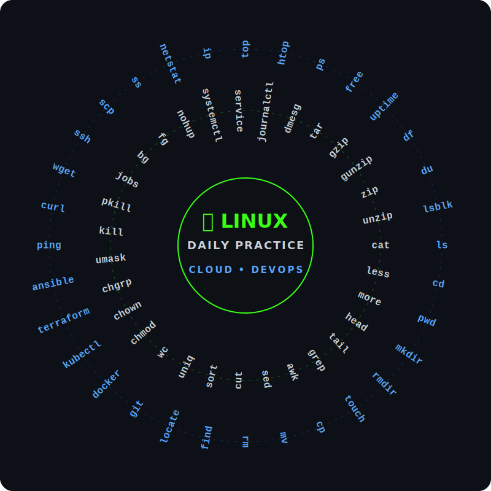

# someshtarra-LINUX_SHELL_SCRIPT
linux

## 🐧 My Daily Linux Command Wheel

I actively use Linux commands in my daily Cloud, DevOps, AWS, server administration, troubleshooting, deployment, and real-time project workflows. The commands below represent the core toolkit I use in production environments.

<p align="center">
  
</p>

> 🐧 **Linux is the backbone of my engineering workflow.** From accessing EC2 instances and troubleshooting deployments with Tomcat and Jenkins, to inspecting system logs and managing Docker/Kubernetes containers—these are the real-world commands I rely on to keep production systems running smoothly.

### 💻 Real-Time Project Workflow

```bash
$ ssh -i project-key.pem ec2-user@server
$ cd /var/log
$ tail -f app.log
$ grep -i "error" app.log
$ df -h
$ free -h
$ ps aux | grep java
$ ss -tulpn
$ sudo systemctl status tomcat
$ sudo journalctl -u tomcat -n 100
$ curl -I http://localhost:8080
$ git pull origin main
$ sudo systemctl restart tomcat
```
